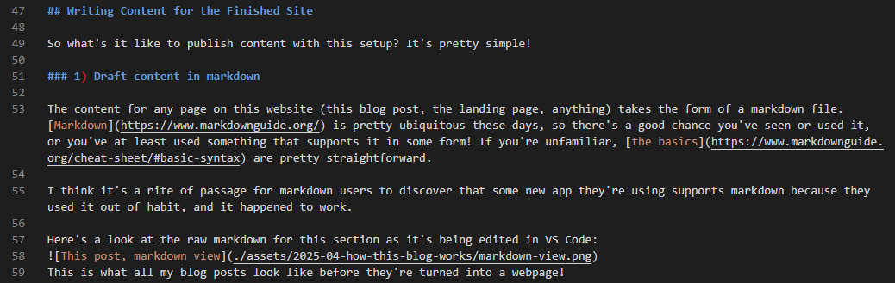
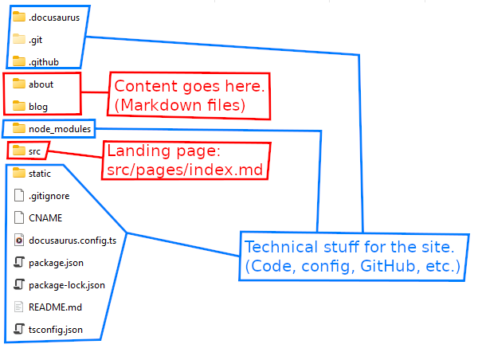

I'm often curious to know how others went about creating their blogs or personal websites, so I figured I'd share those details for this site!

My goal with this post is to explain how I made this site in a way that makes the process feel doable if you have any coding and GitHub experience whatsoever, and at least somewhat interesting if you don't.

<!-- truncate -->

## Too many options

There are way too many options for setting up a personal website or blog!

I've had several false starts with my site.  
I read about static frameworks, and I looked at low-code site builders. I tried [BearBlog](https://bearblog.dev/). I tried [WordPress.com](https://wordpress.com/). I usually struggled with the limitations of low-code options or the more restrictive frameworks, but I've also never had the motivation to dive into the more fully-featured options.

I got furthest with BearBlog. [BearBlog is great!](https://herman.bearblog.dev/manifesto/) If the rest of this looks like too much trouble, **BearBlog is my recommended alternative.** Go support that lil community!

My job was what finally made me find something and stick through it. We needed a site for documentation (etc), and I was the one who had to make it. I work for an open source project ([OpenDI](https://opendi.org/)), so I needed to avoid proprietary tools throughout. So my goals for work had a lot of overlap with typical goals for individual developers looking to put up a personal website, and I got paid to gain experience with tools that would work just as well for my own site.

## Goals

Here's what I wanted out of this project:
- A personal site with some about/bio information, a space for descriptions of my projects, and a Blog with a feed of posts.
- An RSS feed for the blog.
- Minimal subscriptions. Domain names aren't free, but I shouldn't need to pay for much else (if anything).
- Markdown files as my source content. Markdown is easy to write and markdown content is fairly mobile. Many website frameworks injest it.
- A built-in template that looks nice, but that lets me change things like color and layout if I want.
- Room for technical expansion.

## High-level summary

Here's what I'm using:
- [Docusaurus](https://docusaurus.io/) for markdown-based static site generation (MDX supported).
- GitHub Pages for hosting. [Here's my repo.](https://github.com/IAmKelDev/iamkeldev.github.io) Site is deployed automatically with a GitHub Actions workflow.
- My domain registrar is [porkbun](https://porkbun.com/).

This accomplishes all of my goals. Domain registration was pretty cheap, and I spent no other money. I'm not paying for GitHub or Pages, and Docusaurus is open source. I've got some avenues for expansion and customization, and if I decide to ditch Docusaurus later on, I've still got my markdown files.

I'm not doing anything crazy with Docusaurus yet, but my [future plans](#plans-for-the-future) should get more interesting.

## Writing Content for the Finished Site

So what's it like to publish content with this setup? It's pretty simple!

### 1) Draft content in markdown

The content for any page on this website (this blog post, the landing page, anything) takes the form of a markdown file. [Markdown](https://www.markdownguide.org/) is pretty ubiquitous these days, so there's a good chance you've seen or used it, or you've at least used something that supports it in some form! If you're unfamiliar, [the basics](https://www.markdownguide.org/cheat-sheet/#basic-syntax) are pretty straightforward.

I think it's a rite of passage for markdown users to discover that some new app they're using supports markdown because they used it out of habit, and it happened to work.

Here's a look at the raw markdown for this section as it's being edited in VS Code:  
  
This is what all my blog posts look like before they're turned into a webpage!

Raw markdown is fairly readable, and decent editing environments (I'm using [VS Code](/about/software-I-use#visual-studio-code)) will add nice things like syntax highlighting or autocomplete suggestions for file paths in your links. Most editors will let you preview the final rendered form of your document as you edit.

### 2) Put content in the right spot

Docusaurus is a typical site generator. Once you do some initial configuration and tell it where to look for your markdown content, you're free thereafter to just drop new content in the designated folder(s) and let it handle the rest.

Here's my main project folder:  
  
Outlined in blue is mostly initial configuration and project metadata for GitHub.

All text (and image) content goes in the red folders:
- `about/` is set up as a basic ["Docs"](https://docusaurus.io/docs/docs-introduction)-style section, the original use case for Docusaurus. Content maps to my [About](/about/) section. Each file there gets an entry in that section's sidebar.
- `blog/` is configured (appropriately) as a [Blog](https://docusaurus.io/docs/blog)-style section. By default, you're expected to name your files `<date-of-post>-<title-of-post>.md`, so the Blog plugin can sort your posts by date.
- `src/pages/index.md` is a special case. `src/pages` holds "standalone" pages. These aren't part of any section and generally don't get a sidebar. so `src/pages/index.md` is the overall landing/welcome page at https://keldev.net/.

#### Live preview

It's nice to have the option to draft posts in _any_ markdown-friendly editor (even a mobile one like [Obsidian mobile](https://obsidian.md/mobile)), and just drop them into the site files when they're ready. When I'm in serious-drafting mode though, I'm usually working directly in my project's source files, with an instance of my website running locally. This is an intended workflow for Docusaurus. Local preview functionality comes with the default project setup. It's a single command to spin up each time.

With the preview running, the project scans for changes in files, and quickly regenerates your local site preview each time you save. I usually have the markdown file open on one monitor, with my browser open to the local site preview on another, so I can instantly see my content in the final style and format it'll have when it's published.

### 3) Publish

## Setup

At a high level, the setup process looks like this:
- Create a GitHub repository for your site
- Purchase a domain
- Create and configure your Docusaurus project
- Configure DNS stuff
- Set up automatic deployment
- Write your content!

### GitHub

[GitHub Pages](https://pages.github.com/) is GitHub's free hosting service for [static sites](https://en.wikipedia.org/wiki/Static_web_page). If you have a GitHub account, you can throw a basic website up for yourself or one of your projects pretty quickly.

GH Pages intends for sites to be roughly associated with either a GitHub account or a particular repository. By default, they create a domain for your account (mine is https://iamkeldev.github.io). Then when you create a Pages site for a repository, it gets added to the end of your account domain.  
For example, a repo called `my-repo` would get the Pages domain `https://iamkeldev.github.io/my-repo`.

The `github.io` default domain for your account is free, but with some simple configuration you can change it to a custom domain that you've purchased:
> - [GitHub documentation about User Sites vs. Project Sites](https://docs.github.com/en/pages/getting-started-with-github-pages/about-github-pages#types-of-github-pages-sites).
> - [GitHub documentation about configuring your Pages repo to use a custom domain](https://docs.github.com/en/pages/configuring-a-custom-domain-for-your-github-pages-site/managing-a-custom-domain-for-your-github-pages-site#configuring-an-apex-domain)

My repo for this site is set up as my GitHub account's User Site: [IAmKelDev/iamkeldev.github.io](https://github.com/IAmKelDev/iamkeldev.github.io).

## Plans for the future

